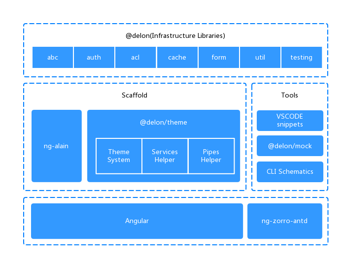

# Zendesk-2022

## Usage
Configuration:  
At first place, please configure the subdomain and API credentials in the **proxy.conf.js** file. Notice for the basic authentication header, the token as a whole, i.e. `zijian@example.com\token:example_token`, should be encoded in Base64-encoded ASCII format. 

Then, please install yarn globally.  
To run a debug server, use the following command:
```
$ yarn && yarn start
```
To run a unit test, use the following command:
```
$ yarn test
```

To simulate the production usage of this ticket viewer, I created a brief login procedure. Using **username=admin** and **password=password** will log you into the ticket viewer. 

## Architecture


## Directory Structure
```
├── _mock                    # Mock
├── src
│  ├── app
│  │  ├── core                 # Core module
│  │  │  ├── i18n
│  │  │  ├── net
│  │  │  │  └── default.interceptor.ts    # HTTP Interceptor
│  │  │  ├── services
│  │  │  │  └── startup.service.ts      # Init setting
│  │  │  └── core.module.ts         
│  │  ├── layout                # General Layout
│  │  ├── routes
│  │  │  ├── **                # Page Directory
│  │  │  ├── routes.module.ts         # Page Routing
│  │  │  └── routes-routing.module.ts     # Page Routing Config
│  │  ├── shared               
│  │  │  └── shared.module.ts     
│  │  ├── app.component.ts          
│  │  └── app.module.ts          
│  │  └── delon.module.ts          
│  ├── assets                  # Static Resources
│  ├── environments               # Environments Configure
│  ├── styles                  # Style Directory
└──└── style.less                # Style Setting
```

## Special Designs

### Credentials
Although it is a good idea to store credentials in a .env file, I worried about the flexibility of this method when we are frequently switching between production environment and development environment. For simplicity I took the configuration approach. Currently my design only leaves the proxy.conf.js as a stand alone file, but in future productions we can leverage the cryptographic library to encrypt the configuration files before it getting injected.

### Unit Test
I used Karma test runner to performe the unit test. I created one testing spec to prove the functionality of my unit test module. I tested if the key dashboard compnent can successfully create the app.